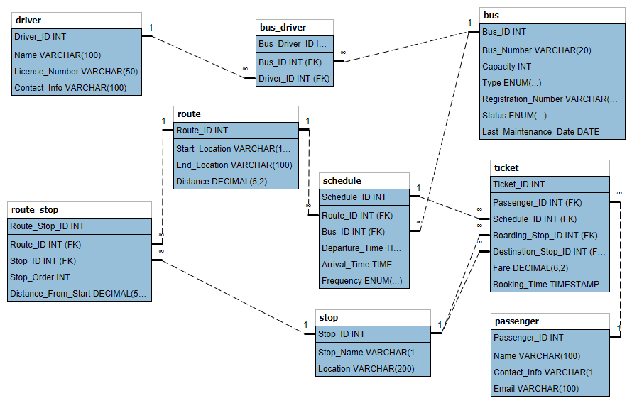

# bus-service-sample-db-design

# Bus Transport System Database Project

## Overview

The Bus Transport System Database Project is designed to facilitate the management of bus transportation services within the Bangalore region. This project utilizes a relational database management system (RDBMS) to efficiently store, manage, and retrieve data related to buses, routes, stops, drivers, and their associations. 

## Key Features

### 1. **Route Management**
- **Route Definition**: Define various routes based on popular destinations in Bangalore.
- **Distance Tracking**: Each route has a specified distance, enabling efficient route planning and cost estimation.

### 2. **Stop Management**
- **Multiple Stops**: Support for multiple stops per route, enhancing the flexibility of bus operations.
- **Locality Awareness**: Stop names are based on well-known locations in Bangalore, improving user familiarity and convenience.

### 3. **Bus Management**
- **Bus Details**: Maintain detailed records of buses, including:
  - **Bus Number**: Unique identification for each bus.
  - **Capacity**: Passenger capacity of each bus.
  - **Type**: Classification of buses (e.g., AC, Non-AC, Sleeper, Seater).
  - **Status**: Real-time status (Active, In Maintenance) to manage operational readiness.
  - **Last Maintenance Date**: Track maintenance history for reliability and safety.

### 4. **Driver Management**
- **Driver Profiles**: Store driver information, including:
  - **Name**: Full name of the driver.
  - **License Number**: Unique identification for each driver.
  - **Contact Information**: Phone numbers for communication and emergency purposes.

### 5. **Data Integrity and Relationships**
- **Foreign Key Relationships**: Ensure data integrity by linking drivers to their respective buses and routes to their stops.
- **Comprehensive Entity Management**: Maintain relationships between entities, such as drivers, buses, and routes, to facilitate efficient data retrieval and management.

### 6. **Scalability**
- **Flexible Expansion**: The schema is designed to easily accommodate additional buses, drivers, routes, and stops as the transportation service grows.
- **Future Enhancements**: Potential for integrating features like ticketing systems, real-time tracking, and user interfaces for customers.

## Database Schema Overview

### Entities

- **Bus**
  - Attributes: Bus_Number, Capacity, Type, Registration_Number, Status, Last_Maintenance_Date
- **Route**
  - Attributes: Start_Location, End_Location, Distance
- **Stop**
  - Attributes: Stop_Name, Location
- **Driver**
  - Attributes: Name, License_Number, Contact_Info
- **Bus_Driver (Linking Entity)**
  - Attributes: Bus_ID, Driver_ID

## Sample Data
- **Routes**: 20 distinct routes covering major locations in Bangalore.
- **Stops**: 50 stops strategically located across Bangalore.
- **Buses**: 40 buses with unique registration numbers and varied capacities.
- **Drivers**: 30 drivers with detailed profiles.

## Conclusion

This Bus Transport System Database Project serves as a robust foundation for managing bus operations in Bangalore, promoting efficiency and reliability in public transport services. Its design ensures scalability and adaptability, making it suitable for future enhancements and expansion.
